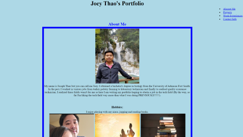
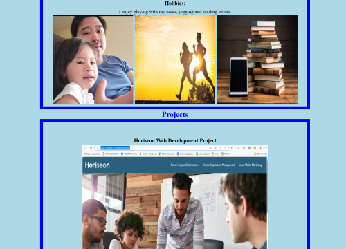
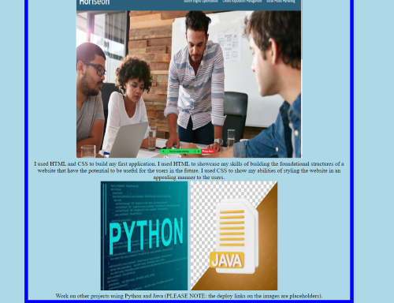

# Joey Thao's Portfolio

https://thaodev23.github.io/portfolio/

https://github.com/Thaodev23/portfolio

## User Story

```
AS a web development student
I want to showcase my portfolio to potential employer(s)
SO that employer(s) can decide whether or not I will be a employee for their company
```

## Acceptance Criteria

```
GIVEN that employer(s) need to have an insight of my previous work
WHEN the employer(s) upload my portfolio
THEN the employer(s) are presented with my name, a photo of me, and links to sections about my biography, projects, work experiences, and how to contact me
WHEN the employer(s) click on one of the links in the navigation bar
THEN the employer(s) will be navigated to the appropriate section
WHEN the employer(s) click on the link to the section about my projects
THEN the employer(s) will be navigated to a section that goes into detail about the projects I worked on
WHEN the employer(s) navigate to the first application I have developed
THEN the image of the first application I developed is bigger in proportion compared to the other projects I worked on
WHEN the employer(s) click on any images in the project section
THEN the employer(s) are taken to the webpages of the project I worked on
```

## First Project

The following shows screenshots of my portfolio that I developed:








## Links To Copy Rights Images

Jogging pic: https://www.google.com/imgres?imgurl=https%3A%2F%2Fimg.freepik.com%2Fpremium-photo%2Fsilhouette-young-couple-running-together-roadtrack_38335-741.jpg%3Fw%3D2000&tbnid=xH7z2C5HEtgKOM&vet=12ahUKEwitsuWqrNiBAxUePN4AHfy-D00QMygJegQIARBn..i&imgrefurl=https%3A%2F%2Fwww.freepik.com%2Fphotos%2Fpeople-running-silhouette%2F2&docid=F74_M9HJ38InhM&w=2000&h=1333&q=free%20copyright%20images%20silhouette%20of%20people%20jogging%20at%20the%20park%20free%20pik&hl=en&ved=2ahUKEwitsuWqrNiBAxUePN4AHfy-D00QMygJegQIARBn 

Books pic: https://www.google.com/url?sa=i&url=https%3A%2F%2Fwww.freepik.com%2Ffree-photos-vectors%2Fe-books&psig=AOvVaw2w9soyt2xUyEMLnis9DrmR&ust=1696370050088000&source=images&cd=vfe&opi=89978449&ved=0CA4QjRxqFwoTCMDX24at2IEDFQAAAAAdAAAAABANU

Digital python pic: https://www.google.com/imgres?imgurl=https%3A%2F%2Fimg.freepik.com%2Fpremium-photo%2Fpython-programming-code-abstract-technology-background_272306-146.jpg&tbnid=lveRNNPOm_dO-M&vet=12ahUKEwjH_IvSic-BAxVMEt4AHUL2IrgQMygmegUIARCoAQ..i&imgrefurl=https%3A%2F%2Fwww.freepik.com%2Ffree-photos-vectors%2Fpython-language&docid=TAkhmT1_UlQDuM&w=626&h=395&q=free%20copyright%20cartoon%20images%20computer%20python%20language%20freepik&hl=en&ved=2ahUKEwjH_IvSic-BAxVMEt4AHUL2IrgQMygmegUIARCoAQ

Digital java pic: https://www.google.com/imgres?imgurl=https%3A%2F%2Fimg.freepik.com%2Fpremium-psd%2Fjava-document-file-format-3d-rendering_507366-963.jpg%3Fw%3D2000&tbnid=b9X9eSv0b9fXjM&vet=12ahUKEwicguDhis-BAxUiId4AHY8lAzIQMyguegUIARCyAQ..i&imgrefurl=https%3A%2F%2Fwww.freepik.com%2Ffree-photos-vectors%2Fjava&docid=oZdoOeqDFyw1AM&w=2000&h=2000&q=free%20copyright%20cartoon%20images%20computer%20java%20language%20freepik&hl=en&ved=2ahUKEwicguDhis-BAxUiId4AHY8lAzIQMyguegUIARCyAQ

Turkey pic: https://www.google.com/imgres?imgurl=https%3A%2F%2Fimg.freepik.com%2Fpremium-vector%2Fcartoon-illustration-turkey_29937-9750.jpg%3Fw%3D2000&tbnid=AaA9YYBjpGcZxM&vet=12ahUKEwjo1o3LiNCBAxX9FN4AHRk0DssQMygLegQIARBe..i&imgrefurl=https%3A%2F%2Fwww.freepik.com%2Fpremium-vector%2Fcartoon-illustration-turkey_30754353.htm&docid=At9tPB9Nihv7tM&w=2000&h=2000&q=free%20copyright%20cartoon%20images%20of%20turkey%20freepik&hl=en&ved=2ahUKEwjo1o3LiNCBAxX9FN4AHRk0DssQMygLegQIARBe

Laboratory pic: https://www.google.com/imgres?imgurl=https%3A%2F%2Fimg.freepik.com%2Ffree-vector%2Fcartoon-laboratory-room-illustration_52683-58725.jpg&tbnid=lHnBry5Te-oBbM&vet=12ahUKEwiiiKj3iNCBAxVIKd4AHUvSCuIQMygFegQIARBX..i&imgrefurl=https%3A%2F%2Fwww.freepik.com%2Ffree-photos-vectors%2Fcartoon-lab&docid=0LfZ6MpAom5gcM&w=626&h=417&q=free%20copyright%20cartoon%20images%20of%20laboratory%20freepik&hl=en&ved=2ahUKEwiiiKj3iNCBAxVIKd4AHUvSCuIQMygFegQIARBX

Seafood pic: https://www.google.com/imgres?imgurl=https%3A%2F%2Fimg.freepik.com%2Fpremium-vector%2Fcartoon-seafood-products-design-menu-shop-poster-package-pile-with-ocean-fish-lobster-oysters-crab-marine-food-vector-set-advertisement-restaurant-shop-with-seafood_102902-4921.jpg%3Fw%3D2000&tbnid=1X66JUkTttuRkM&vet=12ahUKEwi9kPahidCBAxVbFd4AHUoABHEQMygDegQIARBJ..i&imgrefurl=https%3A%2F%2Fwww.freepik.com%2Fpremium-vector%2Fcartoon-seafood-products-design-menu-shop-poster-package-pile-with-ocean-fish-lobster-oysters-crab-marine-food-vector-set-advertisement-restaurant-shop-with-seafood_18507619.htm&docid=RZ1jZeV5iBRKlM&w=2000&h=1499&q=free%20copyright%20cartoon%20images%20of%20seafood%20freepik&hl=en&ved=2ahUKEwi9kPahidCBAxVbFd4AHUoABHEQMygDegQIARBJ


## Collaborators

```
Jason Yang - classmate whom assisted on the assignment.
Github account - https://github.com/Jasony95
```
```
Sichoun Lee - classmate whom assisted on the assignment. 
Github account - https://github.com/DDXP3
```
```
John Coakley - tutor whom asissted on the assignment.
Andres Jimenez - tutor whom assisted on the assignment
```


